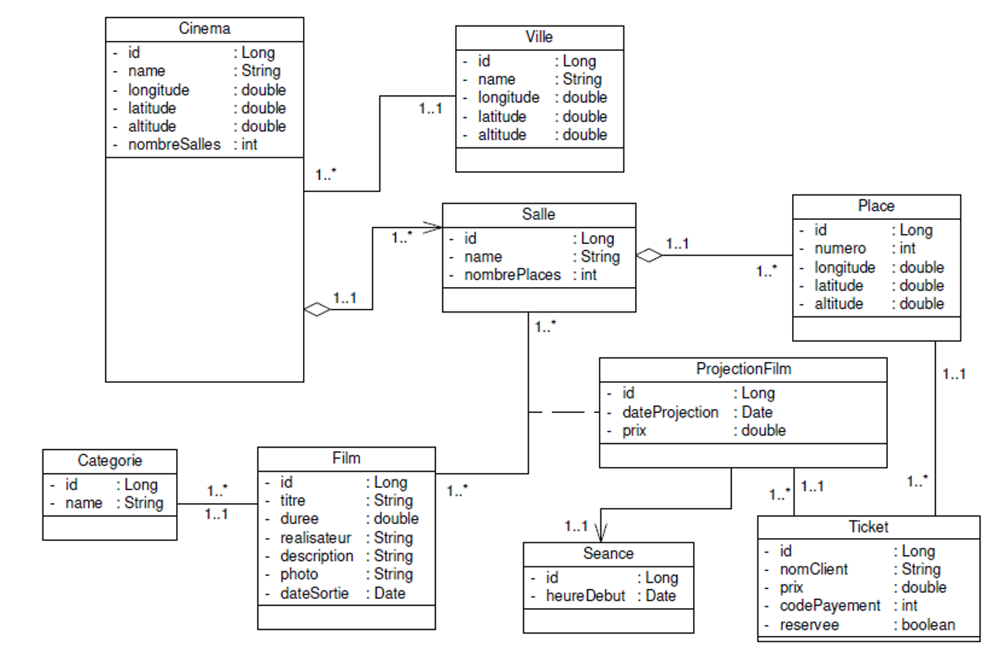

# Project description :
Development of a web application that allows you to manage cinemas in several cities.
### Specifications:
* Each cinema located in a city is defined by its code, name and geographical position. The cinema contains a set of rooms.
* Each room which is defined by its number, its name contains a set of places.
* Each place has a number and is geographically positioned.
* Daily, several film screenings are scheduled in theaters.
* Each Screening takes place in a screening, concerns a Film and takes place in a Room on a screening date, and a fixed price.
* Each Session is defined by its number, and the start time of the session.
* Each screening is provided for a set of Tickets.
* Each Ticket concerns a Place and defined by the name of the customer, the price of the ticket and the payment code.
* The films are classified by categories
### Class diagram

### The functional requirements of the application:
* Cinemas management (Consultations, Entry, Add, Edit, Update and delete)
* Management of Rooms and Places
* Movie management
* Projection management
* Ticket sales management
### The architecture of the application:
The backend part is based on Spring Boot and consists of the DAO, Service (Business) and Web layers.
* The DAO layer is based on Spring Data, JPA, Hibernate
* The Business layer is defined by an interface and an implementation with a few specifications
* functional which requires special calculations or treatments
* The Web layer is based on Restful APIs based on Spring Data